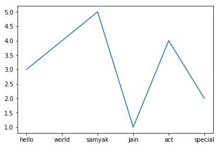

# pynetworkgraph   
python code that receives data from sender and make a graph of message received and their no of occurence  
   
## files included   
* **pyrecv.py** - receive data through port 7890 and arrange them in dictionary with values indicating their no. of occurence  
* **pysend.py** - continuously send data to receiver specified ip address and port no.  
## graph  
**graph is represented by dots , line and bars**  
##### axis  
* x-axis represent unique messages received  
* y-axis represent no of occurence of each message  
 

